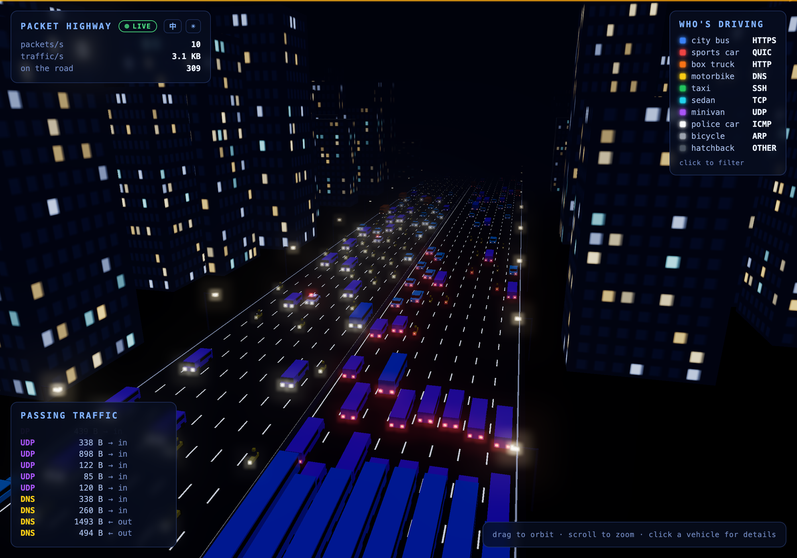
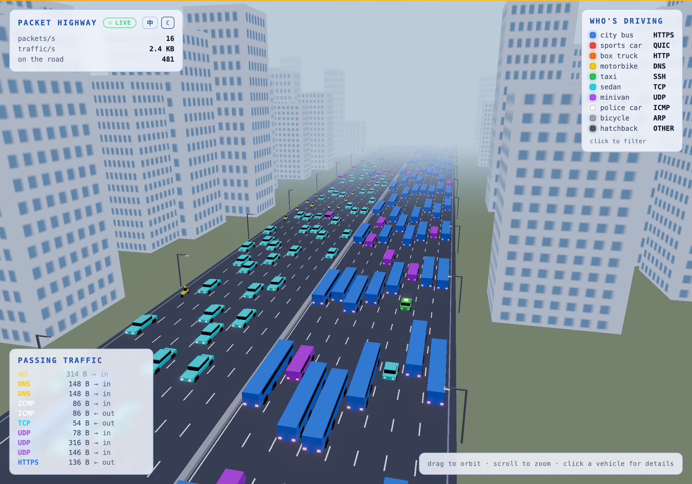

# Packet Highway

Real-time network traffic visualized as low-poly cars on a 3D night highway.
Every packet is a vehicle: protocol picks the car type and color, packet size
sets its speed and length. Inbound traffic drives toward the camera, outbound
drives away.

**▶ Live demo: [highway.qooeo.com](https://highway.qooeo.com)** — static build
with simulated traffic (run locally with tshark for your real packets).



Live capture on a 16-lane highway: cars follow the vehicle ahead and change
lanes to overtake. Day theme included:



## Quick start

```sh
npm install
npm start          # capture + web server, open http://localhost:8339
npm run start:mock # force simulated traffic (no tshark needed)
```

If tshark is missing or lacks capture permission, the server automatically
falls back to **mock mode** (orange MOCK badge instead of green LIVE).

## Live capture requirements

- Install [Wireshark/tshark](https://tshark.dev/) — `brew install wireshark` on macOS.
- Capture needs packet-capture privileges:
  - **macOS** — the BPF devices (`/dev/bpf*`) are root-only by default, and the
    Homebrew *formula* does not fix that. Two options:

    ```sh
    # right now, resets on reboot
    sudo chmod o+rw /dev/bpf*

    # permanent: ChmodBPF opens the BPF devices on every boot
    brew install --cask wireshark-chmodbpf
    ```

    ChmodBPF works through the `access_bpf` group — log out and back in once
    after installing it. (Running `sudo npm start` also works in a pinch.)
  - **Linux**: `sudo setcap cap_net_raw,cap_net_admin=eip $(which dumpcap)` or run with sudo.
- Pick interfaces with `PH_IFACE=en0,utun1500 npm start` (comma-separated).
  Defaults: on macOS the default-route interface **plus any active VPN/proxy
  tunnel** (`utun*` with an IPv4 address — Clash/Surge-style proxies route most
  traffic through their tun, so capturing only `en0` would show encrypted proxy
  packets instead of real protocols); `any` on Linux.

## Protocol → vehicle map

| Protocol   | Vehicle    | Color  |
| ---------- | ---------- | ------ |
| HTTPS      | city bus   | blue   |
| QUIC       | sports car | red    |
| HTTP       | box truck  | orange |
| DNS        | motorbike  | yellow |
| SSH        | taxi       | green  |
| other TCP  | sedan      | cyan   |
| other UDP  | minivan    | purple |
| ICMP       | police car | white  |
| ARP        | bicycle    | gray   |
| everything else | hatchback | dark gray |

## Controls

Drag to orbit, scroll to zoom, click a vehicle for the packet's details
(source/destination IP, ports, protocol, size).

- **Protocol filter** — click a row in the WHO'S DRIVING legend to hide/show
  that protocol's vehicles (and its log entries). Active filters dim the row.
- **中 / EN** — toggle the UI language (defaults to your browser language,
  persisted in localStorage).
- **☀ / ☾** — dark (night city) or light (daytime) theme; switches the whole
  3D scene palette, not just the panels.

## Architecture

- `server/server.js` — spawns `tshark -i <iface> -T ek -l`, parses the JSON
  stream, classifies protocol/direction, batches packets over WebSocket
  (`/ws`), serves the static frontend, mock generator fallback.
- `public/js/` — Three.js scene: `InstancedMesh` vehicle pools (two meshes per
  type: lit body + HDR head/tail lights for bloom), procedural city with
  randomly lit windows, street lamps, lane markings, UnrealBloom post pass.
